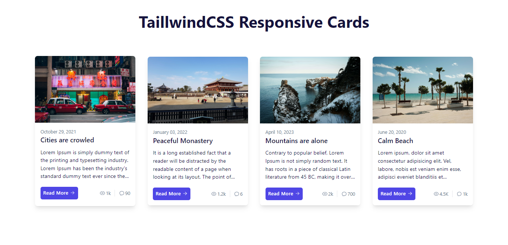

# Taillwind CSS Responsive Cards

Small practice of tailwind css by integrating responsive cards

## Installation:

1. Download or clone the project source code from the GitHub repository.
2. Open the project folder in your code editor.
3. Install dependencies by running the command `npm install` in your terminal.
4. Run the project using the command `npm run dev`.
5. Open your web browser and go to the address "http://localhost:3000" to use the application.

## Small preview

